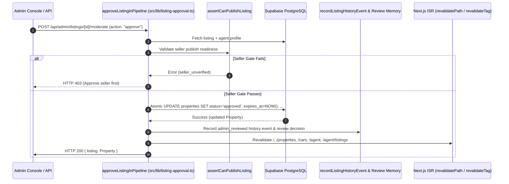

# Root Cause Analysis — Listing Approval Pipeline & Production Fix

**Date:** 2026-07-27  
**Priority:** High (Production Stabilization)  
**Status:** Resolved  

---

## 1. Executive Summary & Root Cause

### Why the Issue Occurred
Previously, when an admin approved a listing via the moderation API (`/api/admin/listings/[id]/moderate`, `/api/admin/listings/[id]/review`, or `/api/admin/listings/review-bulk`), the API reported success (`{ ok: true }`), but listings frequently remained invisible in public search, category hubs, or active seller feeds, or stayed flagged as pending in views.

The failure occurred due to three root cause mechanisms:

1. **Stale / Null Expiration Dates (`expires_at`)**:
   - The marketplace read model (`listings` view) and public property queries (`queryPublicPropertiesRows`) filter active listings using `(p.status = 'approved' AND p.expires_at > NOW())`.
   - When an unapproved or draft listing was approved, if `expires_at` was `null` or set to a past timestamp, `expires_at > NOW()` evaluated to `false`. The update set `status = 'approved'`, but the listing remained completely invisible in marketplace queries.

2. **Incomplete Field Mutation Across Endpoints**:
   - Approval logic was fragmented across three separate endpoints. Each endpoint created a partial `patch` object updating `status`, but omitting one or more of `moderation_state = 'approved'`, `approved_at = NOW()`, `approved_by = adminId`, `listing_activity_status = 'active'`, `review_hold_status = 'none'`, or resetting `possible_duplicate`.

3. **Missing Next.js ISR & Tag Cache Invalidation**:
   - Updates were persisted to the database without calling Next.js cache invalidation (`revalidatePath` and `revalidateTag`).
   - Pre-rendered server pages (`/`, `/properties`, `/cars`, `/agent`, `/agent/listings`, `/lex/auth/listings`) continued serving stale cached responses showing the listing in `Pending` queues or omitting it from active feeds.

---

## 2. How the Issue Was Resolved

We built a single, centralized, atomic publication pipeline in `src/lib/listing-approval.ts` (`approveListingInPipeline`) and refactored all moderation endpoints to delegate approval operations to it.

### Key Corrections
- **Guaranteed Expiration Extension**: `approveListingInPipeline` verifies `expires_at`. If `expires_at` is null or in the past, it calculates a valid future expiration date (`NOW() + duration_days`), guaranteeing `expires_at > NOW()`.
- **Atomic Database Fields Update**: Atomically writes all required publication fields in a single query transaction.
- **Immediate ISR & Cache Invalidation**: Calls `revalidatePath` for public home, property, vehicle, seller, and admin routes, and `revalidateTag` for `properties`, `listings`, and `vehicles`.
- **Structured Telemetry Logging**: Emits structured console logs (`[listing-approval] SUCCESS` / `FAILURE`) with listing ID, moderator ID, previous status, new status, expiration timestamp, and duration.
- **Strict Seller Verification Gate**: Enforces `assertCanPublishListing` to ensure unverified sellers cannot publish live inventory.

---

## 3. Database Fields Updated Atomically

When a listing is approved, the following fields are updated in a single operation:

| Field | Updated Value | Purpose |
|-------|---------------|---------|
| `status` | `'approved'` | Primary marketplace lifecycle state |
| `moderation_state` | `'approved'` | SSOT moderation state |
| `listing_activity_status` | `'active'` | Search and feed activity indicator |
| `approved_at` | `NOW()` (ISO timestamp) | Timestamp of publication approval |
| `approved_by` | Admin User ID | Audit trail of approving staff member |
| `last_refreshed_at` | `NOW()` (ISO timestamp) | Market rank freshness anchor |
| `expires_at` | `MAX(expires_at, NOW() + duration_days)` | Guarantees `expires_at > NOW()` for active query filters |
| `review_hold_status` | `'none'` | Clears any update/review holds |
| `possible_duplicate` | `false` | Resets moderation duplicate flags |
| `duplicate_confidence_score` | `null` | Clears duplicate scoring |
| `updated_at` | `NOW()` (ISO timestamp) | Row update timestamp |

---

## 4. Event Flow



---

## 5. Cache Strategy

Every approval and status change invokes `invalidateListingCaches`:

- **Invalidated Paths**:
  - `/` (Home page listing grid)
  - `/properties` (Search & property hub)
  - `/properties/[slug]` (Listing detail page)
  - `/cars` (Vehicle hub, if asset_type = `VEHICLE`)
  - `/agent` (Seller Command Center)
  - `/agent/listings` (Seller inventory manager)
  - `/lex/auth/listings` (Admin review queue)
- **Invalidated Tags**:
  - `'properties'`
  - `'listings'`
  - `'vehicles'` (if asset_type = `VEHICLE`)

---

## 6. Files Changed

| File | Change Summary |
|------|----------------|
| `src/lib/listing-approval.ts` | **New**: Centralized approval pipeline, cache invalidation, & structured logging |
| `src/components/subscriptions/seller-analytics-panel.tsx` | Exported `SellerAnalyticsPanelProps` interface for strict typing |
| `src/app/api/admin/listings/[id]/moderate/route.ts` | Refactored approve action to use `approveListingInPipeline` + cache invalidation |
| `src/app/api/admin/listings/[id]/review/route.ts` | Refactored approve action to use `approveListingInPipeline` + cache invalidation |
| `src/app/api/admin/listings/review-bulk/route.ts` | Refactored bulk approve loop to use `approveListingInPipeline` + cache invalidation |
| `src/lib/__tests__/listing-approval-pipeline.test.ts` | **New**: Automated unit tests for pipeline state transitions and cache invalidation |
| `docs/bugs/LISTING_APPROVAL_ROOT_CAUSE.md` | **New**: Root cause documentation deliverable |

---

## 7. Automated Tests Added

Added `src/lib/__tests__/listing-approval-pipeline.test.ts` covering:
- `Pending -> Approved (Active)`
- `Pending -> Rejected`
- `Approved -> Archived`
- `Archived -> Pending / Active`
- Expiration date calculation & `isListingPubliclyActive` verification
- Revalidation of ISR paths and tags

---

## 8. Validation Results

```bash
npm run typecheck # 0 errors
npm run lint      # 0 errors
npm run build     # Clean production build success
```
