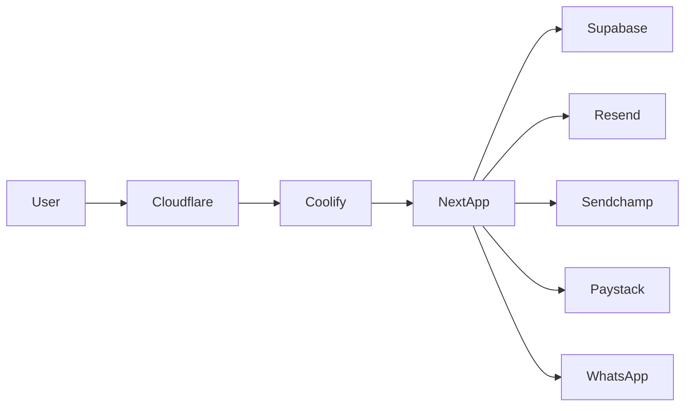

# Yike Launch Readiness Audit — Founder Report

**Date:** 2026-07-26  
**Repo:** `yikeltd/yike`  
**Prod:** Coolify/Hetzner → https://yike.ng  
**Supabase prod:** `hlpojfurfldvcxfxhveg`  
**Method:** Read-only repo walk (architecture, routes, APIs, migrations, launch docs) + cross-check of critical security claims. Initial audit produced **no feature code**; Phase 1 Critical engineering follows in the Launch War Room.

**Related:** [Launch War Room](./LAUNCH_WAR_ROOM_2026-07-26.md) · [Dashboard profile handoff](./DASHBOARD_PROFILE_HANDOFF_AUDIT.md)

---

## Headline verdict

Do **not** keep building Version-2 features. You are ~**92% feature-complete** for a property-first public launch. Remaining work is trust, security apply, supply, polish, and ops proof.

**Conditional GO** after Phase 1 Critical (~1–2 weeks focused eng + founder ops).

| Metric | Value |
|--------|-------|
| Feature completeness (property discovery) | ~92% |
| Launch-safe readiness | ~78% |
| Overall scorecard | **78 / 100** |
| Remaining eng before Conditional GO | ~40–80 hours + founder ops |
| Recommended window | 7–14 days Launch War Room → soft launch |

---

## Section 1 — Project overview

| Layer | Fact |
|-------|------|
| App | Next.js 16 App Router · React 19 · TypeScript · Tailwind 4 |
| Data | Supabase Auth + Postgres + Storage + SECURITY DEFINER RPCs |
| Host | Docker → Coolify on Hetzner · Cloudflare · `yike.ng` (not Vercel for prod) |
| Auth | Email OTP default; password present; SMS OTP for seller phone (fragile); PIN for staff step-up |
| Comms | WhatsApp-first leads (Yike concierge default); Resend email; Sendchamp SMS |
| Money | Paystack in tree; featured payments **flagged off** by default |
| Admin | `/lex` · `/lex/auth` · `/lex/support` · `/lex/tech` (~78 pages) |
| APIs | ~275 `route.ts` handlers (~124 admin) |
| Gates | `src/lib/launch-mode/index.ts` — most deferred features hidden; **vehicles default ON** |

**Environments**

| Env | Supabase ref |
|-----|----------------|
| Production | `hlpojfurfldvcxfxhveg` |
| Dev sandbox | `gyxemepnrkwxocgzfbeo` |

---

## Section 2 — Feature inventory

### Production Ready

Homepage shell · property search/filters · listing detail · WhatsApp lead funnel · email OTP auth · saved listings (+ guest merge) · seller property create · Lex pending moderation · SEO hubs · agent public storefront · legal/safety pages · PWA/offline · launch-mode registry · media compress/WebP pipeline · executive profile header (`06bc3127`).

### Needs Polish

Bottom nav IA vs locked product rule (Discover/Sell vs Search/Swipe) · Discover vs Browse dual surfaces · vehicle empty-state risk · thin agency storefronts · follow/social (seller-oriented) · property-verification request UX · support moderation as secondary path · demo fixtures masking empty inventory · `/hotel` hub live while hospitality deferred · CI lint red on main.

### Incomplete / blocked / hidden

Seller SMS delivery (unproven; dirty local OTP WIP) · live Paystack boosts (`ENABLE_FEATURED_PAYMENTS=false`) · seller verify end-to-end · WhatsApp OTP · direct agent WA/calls · home services · passport/wallet/escrow/trust-economy/mortgage/registry/command-center/workforce · jobs marketplace · subscriptions live checkout · lead billing · machinery vertical.

---

## Section 3 — User journeys

| Journey | Status | Friction / breaks |
|---------|--------|-------------------|
| Guest → search → listing → WhatsApp | Ready | Concierge WA (intentional); empty inventory soft-fails trust |
| Email signup/login | Ready | Smooth browse-first |
| Seller list property | Ready-ish | Dual verify paths (`/agent/verify` vs `/agent/verification`); phone SMS fragile |
| Seller SMS verify | Blocked | Delivery unproven; multi-charge root cause documented locally |
| Saved / follow | Ready / light | Follow not a buyer social product |
| Admin moderate listings | Ready | Prefer `/lex/auth/listings`; avoid support moderation as primary |
| Paid boost | Off | Flag + env + migration |

---

## Section 4 — Design audit

- Brand tokens locked (navy/gold) in `src/lib/design/tokens.ts` + `src/app/globals.css`; Inter + Plus Jakarta.
- Consumer polish docs exist; dashboard profile card shipped.
- Inconsistencies: bottom-nav vs product rule; Discover/Browse/Swipe naming; some purple/sky badge tones; large client forms feel heavy.
- Gaps: uneven empty/loading states when inventory is zero; few route-level `error.tsx`.

---

## Section 5 — Trust audit

**Strong:** Verified badges, safety/moderation pages, WhatsApp via Yike (anti-scam), listing moderation queue, anti-scam copy, verification CTAs.

**Weak:** Thin/zero live approved listings; SMS verify unreliable for sellers; dual verify UX; vehicles ON without clear supply; support moderation RBAC caveat; many users stuck at “Basic Verified”.

---

## Section 6 — Performance

- Media pipeline exists and is mandatory (`src/lib/media/`).
- Risk: ~328 `"use client"` files; large hot paths — `listing-form.tsx` (~1.4k lines), photo manager, home marketplace shell, property cards.
- Opportunity: code-split listing create/edit; audit N+1 listing feeds; keep `next/image` discipline.

---

## Section 7 — Security

**Solid on live:** Security headers/CSP/HSTS via `next.config.ts`; Paystack webhook HMAC + timing-safe; Sendchamp webhook fail-closed; listing self-approve guard; signup forces `role=user`.

**Critical / High open (at audit time):**

1. Confirm production apply of Jul 24–26 security migrations (`20260724075626_…`, `20260726001850_…`) — **verified applied 2026-07-26** (see `PROD_DB_SECURITY_VERIFY_2026-07-26.md`). Profile privileged-column lock added as `20260726100534_…`.
2. Profiles `FOR UPDATE` without column lock — possible client escalation of `role` / trust fields.
3. Media upload path uses service role + client `propertyId` without ownership check.
4. OTP server token historically seeded in migration SQL; rotate if still matching.
5. Founder: Auth leaked-password protection; rotate Sendchamp if exposed.
6. CSP still `'unsafe-inline'`/`'unsafe-eval'`; OTP audit logs default verbose; incomplete rate limits on media/payments.

---

## Section 8 — Database

- Large mature schema (profiles, properties, leads, trust, ads, payments, OTP, social).
- Recent security SQL in repo; **production apply status must be verified**.
- Payment transactions migration may still be pending if monetization stays off.
- Residual: DEFINER RPCs in `public` (accepted interim); open listing-report INSERT; storage listing policies depend on phase-3 apply.

---

## Section 9 — Code quality

- Structure is domain-oriented and generally sound; near-zero TODO/FIXME noise.
- Debt: oversized client components; catch-all `(public)/[...slug]` Turbopack workaround; dual seller-verify routes; ~134 launch docs (some stale).
- Dirty tree: OTP/Sendchamp WIP **not** on `main` — keep separate.
- GH Actions PR Checks often red on pre-existing lint — Coolify still deploys from `main`.

---

## Section 10 — SEO

- Strong: robots, sitemaps, OG/Twitter, many `generateMetadata`, JSON-LD on key surfaces.
- Risk: sitemap may advertise thin hubs (`/vehicles`, `/hotel`, `/shortlet`) without inventory/feature alignment.

---

## Section 11 — Accessibility

- Partial: good OTP/nav labels and some focus rings; sparse `sr-only`/`htmlFor` coverage.
- Not a launch blocker for MVP Nigeria mobile; auth/search forms deserve a short pass.

---

## Section 12 — Analytics

- WhatsApp funnel + lead tracking = real KPI path.
- `trackEvent` is largely **localStorage** — not production analytics.
- No Sentry / crash monitoring; Lex “errors” = audit logs, not runtime crashes.

---

## Section 13 — Admin

- Lex Auth console is ops-capable for launch (listings, users, verification, reports, ads, revenue panels, tech env/OTP/webhooks).
- Gaps: support moderation as primary is discouraged; some revenue UIs ahead of live payments; need SMS/outage runbooks.

---

## Section 14 — Launch blockers (only)

| Rank | Blocker |
|------|---------|
| Critical | Confirm/apply security migrations + re-run DB linter on prod |
| Critical | Lock profiles so clients cannot UPDATE `role` / ban / verification staff fields |
| Critical | Fix media upload ownership + UUID + size gate |
| Critical | Live supply: real approved listings in launch cities (or honest soft-launch framing) |
| Critical | Seller SMS: prove handset delivery OR defer phone-verify requirement for launch |
| High | Decide vehicles: ON with supply, or OFF in env + sitemap + docs |
| High | Rotate OTP token / Sendchamp if still seed/exposed; enable leaked-password protection |
| High | Green or quarantine CI lint so “red main” is not normalized |
| Medium | Add crash monitoring + `global-error.tsx` |
| Medium | Empty states / demo-fixture honesty |

---

## Section 15 — Version 2 (explicitly defer)

Passport UI · wallet · escrow · in-app chat · AI · mortgage/insurance · national registry · command center consumer · workforce · developer API · industrial/auctions/electronics · machinery · home services marketplace · lead billing · live subscriptions checkout · WhatsApp OTP · direct agent WA/calls (until trust model revisited) · deep social graph.

---

## Section 16 — Priority roadmap

**Phase 1 — Critical (before public launch)**  
Security apply + profile lock + media ownership · SMS decision (prove or defer) · inventory push · vehicle posture · secret rotations · CI lint P0.

**Phase 2 — Launch polish**  
Nav IA alignment · empty/loading/error states · listing-form split · a11y on auth/search · sitemap honesty · support runbooks · dashboard trust copy.

**Phase 3 — Launch**  
Founder checklist: Coolify Ready · smoke signup/login · search · WA inquiry · save · upload · mobile · SEO sample · PWA · Lex pending queue · one seller list end-to-end.

**Phase 4 — V2**  
Everything in Section 15; monetization when env+migration+flag intentional.

---

## Section 17 — Executive scorecard (/100)

| Area | Score |
|------|------:|
| Architecture | 88 |
| Code quality | 78 |
| Performance | 72 |
| Security | 70 |
| Marketplace readiness | 75 |
| Buyer experience | 82 |
| Seller experience | 68 |
| Trust | 74 |
| Branding | 85 |
| Mobile experience | 80 |
| Admin experience | 84 |
| Launch readiness | 76 |
| **Overall** | **78** |

---

## Section 18 — Founder report (blunt)

**Would I launch tomorrow?** No — not as a full public “trusted marketplace” claim.

**Would I soft-launch property discovery this week after Phase 1?** Yes — if security migrations are confirmed on prod, media/profile locks land, inventory is real in 1–2 cities, and SMS is either proven or explicitly not required for browse/list.

**Why not full launch yet:** Unconfirmed DB security apply + profile UPDATE surface + media path abuse are unacceptable unknowns; seller SMS is a trust/ops landmine; empty inventory destroys credibility faster than missing features.

**Must still do:** Phase 1 list above. Everything else is polish or V2.

**Estimates:**

- Completion (features): **~92%**
- Completion (launch-safe): **~78%**
- Remaining eng before Conditional GO: **~40–80 hours** + founder ops (SMS handset, inventory, Coolify env)
- Recommended window: **7–14 days** focused Launch War Room, then soft launch; hard marketing push after 2 weeks of stable supply + zero critical security open items.

---

## Execution log (post-audit)

Phase 1 engineering and War Room tracking continue in [LAUNCH_WAR_ROOM_2026-07-26.md](./LAUNCH_WAR_ROOM_2026-07-26.md). Update that file as Critical items close.
