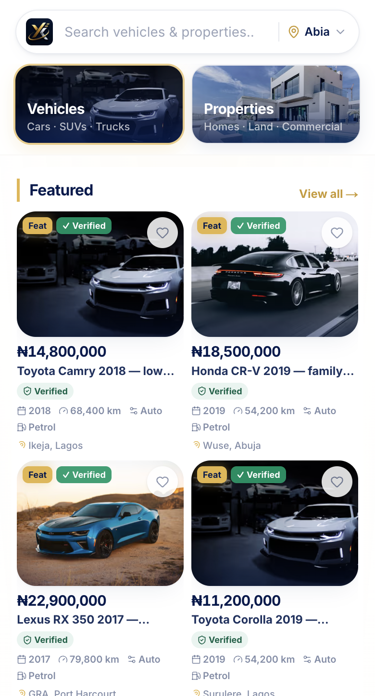
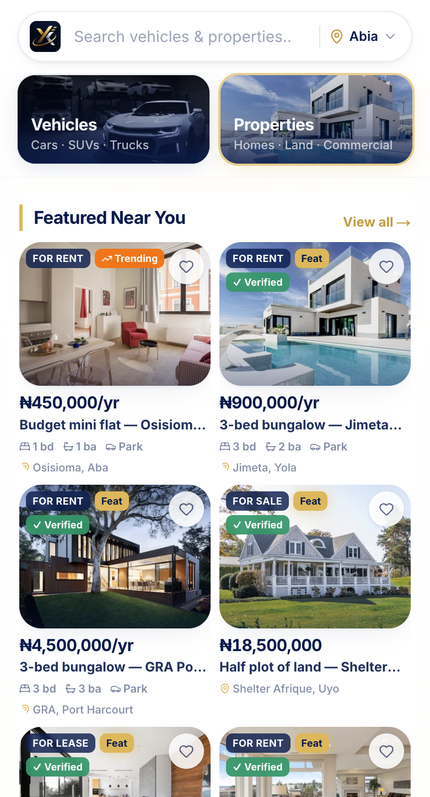
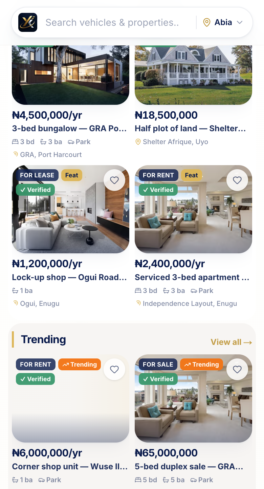

# Mobile Header V2 — Premium Category Experience

**Status:** Founder-approved UI refinement (presentation only)  
**Date:** 2026-07-26  
**Scope:** Mobile header search chrome + home category entry banners

## Summary

V2 replaces the V1 chip / mic chrome with an Airbnb/Apple-style header:

1. Microphone removed (voice search not available).
2. Yike logo moved **inside** the search pill (tappable → home).
3. Search bar balanced with generous side padding; no external logo row.
4. Placeholder: **Search vehicles & properties…**
5. Vehicle / Property redesigned as **premium photographic category banners** (~80px), not icons or mini listing cards.
6. Banners auto-hide on scroll; search stays sticky.

**No business logic changed** — search routing, location selector, category query switching (`?category=`), analytics placement keys, and launch gates are unchanged.

## Files modified

| File | Change |
|------|--------|
| `src/components/layout/header-mobile.tsx` | Logo-in-search layout; no mic; banner scroll collapse |
| `src/components/search/header-universal-search.tsx` | `showLogo`; mic UI removed; default placeholder |
| `src/components/layout/header-desktop.tsx` | Mic removed from desktop search (presentation only) |
| `src/components/home/marketplace-category-chips.tsx` | Image-first category banners |
| `src/lib/home/category-chip-assets.ts` | Points at WebP category covers |
| `public/images/categories/vehicle-banner.webp` | Vehicle cover photo |
| `public/images/categories/property-banner.webp` | Property cover photo |

Removed obsolete SVG chip assets (`vehicle-chip.svg`, `property-chip.svg`).

## Before / After

### Before (V1)

- External logo + full-width search with mic affordance  
- Mini split chips (illustration + label) resembling listing cards  

See V1 docs: [`MOBILE_HEADER_REFINEMENT.md`](./MOBILE_HEADER_REFINEMENT.md)  
Screenshots: `screenshots/mobile-header-top.png`

### After (V2)







### Responsive

| Viewport | Screenshot |
|----------|------------|
| iPhone (~390×844) | `screenshots/mobile-header-v2-top.png` |
| Home (browser mobile) | `screenshots/mobile-header-v2-home.png` |

## Behaviour (unchanged logic)

| Interaction | Behaviour |
|-------------|-----------|
| Logo (in search) | Navigate `/` |
| Search input / suggestions | Existing `HeaderUniversalSearch` commit/route |
| Nigeria / location control | Existing `MarketplaceLocationIndicator` |
| Vehicles / Properties banners | Existing `?category=` replace on home; fallback hrefs off-home |
| Scroll | `scrollY ≤ 16` show banners; `> 40` hide (`max-height` + opacity + translate) |

## Explicit non-changes

- Search API / smart-search parsing  
- Marketplace routing beyond presentation  
- Auth, Capability Runtime, YIP, plugins  
- Database / Supabase  
- Backend moderation or listing logic  

## Verification

```bash
npm run lint        # pass
npm run typecheck   # pass
npm run build       # pass (see session log)
```

## Success checklist

- [x] Microphone removed  
- [x] Logo inside search bar  
- [x] Search bar width / padding refined  
- [x] Country selector remains inside search  
- [x] Premium category banners (photo covers, not listing cards)  
- [x] Smooth hide/show on scroll  
- [x] No business-logic regressions intended  
- [x] Docs + screenshots  
