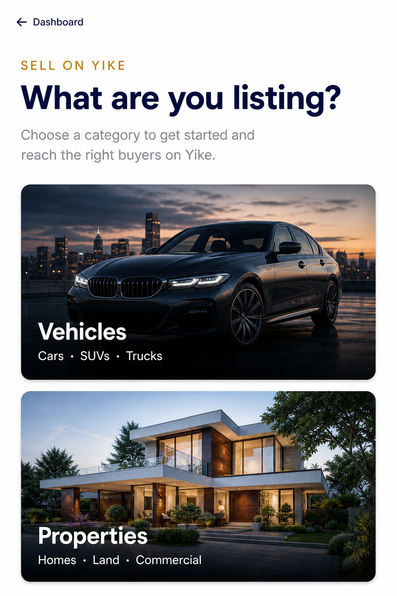

# Seller Flow Redesign — Design System Rollout

**Date:** 2026-07-26  
**Type:** Visual rollout only (no business logic)  
**Reference:** Homepage + mobile header V2 premium language

## Principle

The homepage is the design reference. Seller screens reuse the same spacing, typography, radius, shadows, gold/navy hierarchy, pressable micro-interactions, and image-first category covers — they do not invent a parallel admin aesthetic.

## Screens audited

| Screen | Route | Status |
|--------|-------|--------|
| Choose listing type | `/agent/listings/choose` | Modernized — premium category gateways |
| New property | `/agent/listings/new` | Modernized — `SellerFlowShell` |
| New vehicle | `/agent/listings/new/vehicle` | Modernized — `SellerFlowShell` |
| Edit listing | `/agent/listings/[id]/edit` | Modernized — `SellerFlowShell` |
| Listing engine steps / publish / success | `ListingEngine` | Modernized — pills, CTAs, success card |
| My listings | `/agent/listings` | Modernized — header + tab chrome |
| Seller verification | `/agent/verify` | Light polish — eyebrow + spacing |
| Dealer onboard | `/agent/onboard` | Already on premium wizard chrome (unchanged) |
| Plans / company / leads | `/agent/plans`, `/agent/company`, … | Deferred — next rollout pass |

## Components reused

| Component | Use |
|-----------|-----|
| [`CategoryGatewayCard`](../../src/components/marketplace/category-gateway-card.tsx) | Homepage chips + seller choose (shared) |
| [`CATEGORY_CHIP_ASSETS`](../../src/lib/home/category-chip-assets.ts) | Same vehicle/property cover WebPs |
| [`SellerFlowShell`](../../src/components/agent/seller-flow-shell.tsx) | Consistent seller page chrome |
| Homepage search header | Unchanged — already premium |

Homepage category chips now render through `CategoryGatewayCard` so consumer and seller category covers stay one language.

## Legacy UI removed

- Icon-in-box Vehicle / Property form cards (`Car` / `Building2` outlined rows)
- Generic “Choose Listing Type” admin heading treatment
- Soft bordered listing-engine CTAs → rounded-full gold/navy pressables
- Flat “My listings” header + primary text links → gold eyebrow + navy CTA pill
- Oversized empty stacking without hierarchy (choose page)

## Before / after

### Before (legacy choose)

Outlined icon cards — admin-form feel (founder screenshot reference).

### After (premium gateways)



Shared category language on homepage (same component, compact size):


## Confirmation — no business logic changed

- No API / database / routing / YIP / Capability Runtime / Financial / Listing Engine rewrite
- Choose still links to `/agent/listings/new/vehicle` and `/agent/listings/new`
- Seller verification gates and listing submit adapters unchanged
- Presentation and shared chrome only

## Validation

```bash
npm run lint -- --quiet
npx tsc --noEmit
npm run build
```

## Next rollout candidates

Bring the same shell + pressable language to `/agent/plans`, `/agent/company`, `/agent/leads`, and legacy `listing-form.tsx` paths still reachable from older entry points.
